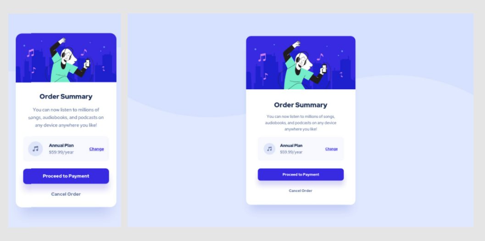
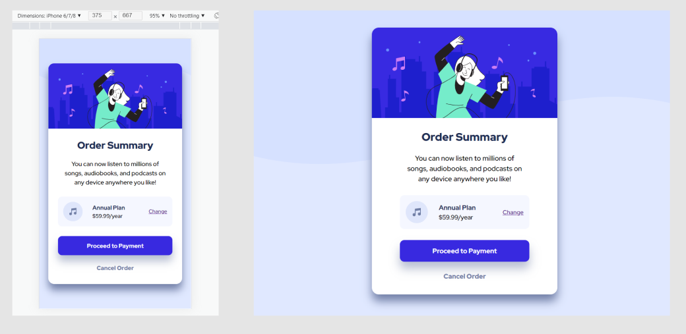
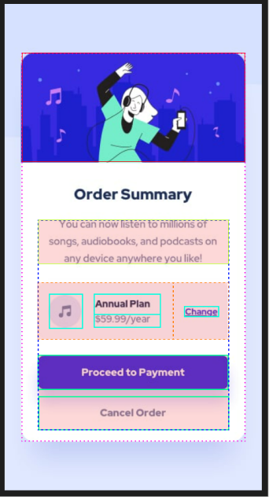
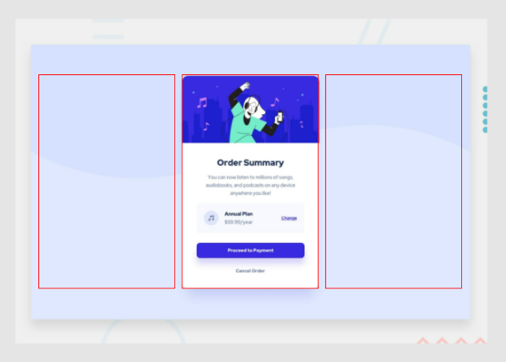

# Frontend Mentor - Order summary card solution

This is a solution to the [Order summary card challenge on Frontend Mentor](https://www.frontendmentor.io/challenges/order-summary-component-QlPmajDUj). Frontend Mentor challenges help you improve your coding skills by building realistic projects.

## Table of contents

- [Overview](#overview)
  - [The Goal Design](#The-Goal-Design)
  - [My Outcome](#My-Actual-Outcome)
- [My process](#my-process)
  - [Built with](###This-is-built-with)
    - [Provided information](#Provided-information)
  - [I tried to focus on...](#I-tried-to-focus-on)
    - [Mobile Version](#Mobile-Version)
    - [Desktop Version](#Desktop-version)
- [Useful resources](#useful-resources)
- [Author](#author)

## Overview

### The Goal Design

> [Official Instruction](challenge.md) <br>
> Your challenge is to build out this order summary card component and get it looking as close to the design as possible.
>
> You can use any tools you like to help you complete the challenge. So if you've got >something you'd like to practice, feel free to give it a go.
>
> Your users should be able to:
>
> - See hover states for interactive elements

(Mobile design | Desktop design)


### My Actual Outcome

(Mobile design | Desktop design)


## My process

### This is built with

- Semantic HTML5 markup
- CSS custom properties
- Flexbox
- CSS Grid
- Mobile-first workflow

#### Provided Information

- Layout
  - Mobile: 375px
  - Desktop: 1440px
- Colors
  - Primary
    - Pale blue: hsl(225, 100%, 94%)
    - Bright blue: hsl(245, 75%, 52%)
  - Neutral
    - Very pale blue: hsl(225, 100%, 98%)
    - Desaturated blue: hsl(224, 23%, 55%)
    - Dark blue: hsl(223, 47%, 23%)
- Typography
  - Body Copy
    - Font size (paragraph): 16px
  - Font
    - Family: [Red Hat Display](https://fonts.google.com/specimen/Red+Hat+Display)
    - Weights: 500, 700, 900

---

### I tried to focus on

- writing CSS/HTML that is easy even for others to understand.
- making the responsive design without media queries.
- building mobile first.
- No random margin or padding just to make it look like the goal design.

---

##### 📱Mobile Version

First of all, I tried to understand the structure and grouped elements by drawing outlines (as in the picture below).<br>
I think it helped me a lot later on when I set margin and padding as well.



- **Annual Plan and the price** is slightly closer to music icon. That's why I grouped them out.
- **Order Summary** had exactly same margin for top and bottom and didn't wanna have extra gap between the next element, which is a paragraph. That's why it's excluded from the float "inner-wrapper". I could use `<h1></h1>` instead of `<h2></h2>`. I thought there could be something else and intensionally avoided. But `<h1></h1>` shouldn't be a problem.

One thing, I couldn't find the best way is here.

```html
<div class="plan-details">
  
  <div>
    <strong>Annual Plan</strong>
    <small>$59.99/year</small>
  </div>
</div>
```

```css
.plan-details {
  display: flex;
  align-items: center;
  gap: 1.5rem;
}
```

At first, I thought that I could use float:left on the icon.<br> Then, because it looks like some sort of list, even though it has only one item in it, I tried to use list and set the image as list-style-image but it didn't work as I imagined.<br>
It was easier to center the text vertically by flexbox.
So I ended up using flexbox. I don't know if it was a good solution since now I have a flex in a flex item. And it looks a bit complicated for such a simple thing.

---

#### 🖥️Desktop Version

To adjust both desktop and mobile screen, I used grid. I decided the size like this (picture below).



```css
.body {
  display: grid;
  grid-template-columns: 1fr minmax(330px, calc(100vw / 3)) 1fr;
  grid-template-rows: 1fr auto 1fr;
  gap: 1rem;
}
```

- All the margin around the main content is set by **1fr** to be flexible.
- To my eyes, desktop version looked a little wider so that's why I used **minmax(330px, calc(100vw / 3))**

## 📗Useful Resources

- [MDN Web Docs](https://developer.mozilla.org/) - I find anything I need explanation for.
- [Markdown Guide](https://www.markdownguide.org/) - Markdown Guide
- [Github Docs](https://docs.github.com/en/github/writing-on-github/getting-started-with-writing-and-formatting-on-github/basic-writing-and-formatting-syntax) - Markdown Guide

## Author

###### Little about me

I'm studying front-end programming in Stockholm, Sweden.
Front-end programming lesson started in October 2021.
We just finished basic HTML and CSS and to review what I have been though in the lessons I wanted to try this challenge.
This is my very first README.md as well.

- [T]
- Frontend Mentor - [@SparklingRaindrop](https://www.frontendmentor.io/profile/SparklingRaindrop)
- Twitter - [@t_frontend_dev](https://twitter.com/t_frontend_dev)
